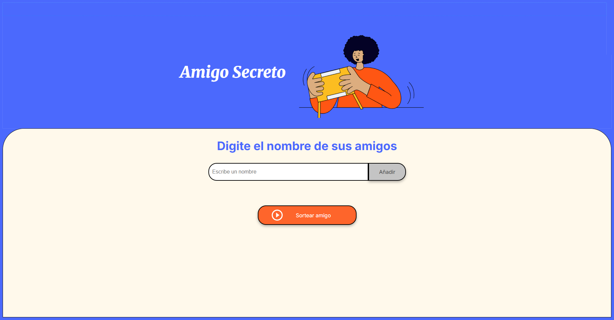

# 🎁 Challenge Final: Amigo Secreto - Sorteo Automático (Formación Principiante en Programación G8 - ONE)



### Un divertido proyecto para realizar sorteos de **Amigo Secreto** de manera automática, utilizando **HTML, CSS y JavaScript**.

---

## 🚀 **Descripción del Proyecto**
Este proyecto permite a los usuarios **ingresar una lista de amigos** y realizar un **sorteo aleatorio** para determinar quién será el Amigo Secreto. La aplicación está diseñada con una interfaz moderna y responsiva.

🔹 **Funcionalidades principales:**
- 📝 Ingresar nombres en una lista.
- 🔄 Mostrar los nombres ingresados en pantalla.
- 🎲 Realizar un sorteo aleatorio.
- ✅ Mostrar el nombre del Amigo Secreto seleccionado.
- 🗑️ Limpiar la lista después del sorteo.
- 🎓 **Funcionalidad didáctica:** Diseñado para fortalecer habilidades en **JavaScript, lógica de programación y manipulación del DOM**.

---

## 🛠 **Tecnologías Utilizadas**

✅ **HTML5** - Estructura de la aplicación.  
✅ **CSS3** - Estilos, diseño responsivo y efectos visuales.  
✅ **JavaScript (ES6)** - Lógica de programación para el sorteo aleatorio.  
✅ **Git & GitHub** - Control de versiones y despliegue del proyecto.

---

## 🎓 **Proyecto desarrollado en la Beca Grupo 8 de Alura Latam y Oracle Next Education (ONE)**
Este proyecto fue realizado como parte final de la Formación Principiante en Programación G8 - ONE gracias a:
- 🎓 [Alura Latam](https://www.linkedin.com/school/alura-latam/)
- 🏢 [Oracle Next Education (ONE)](https://www.linkedin.com/company/oracle)

🔹 **Agradecimientos especiales a los profesores que guiaron este desafío:**  
👨‍🏫 [Christian Paul Velasco Algaranaz](https://www.linkedin.com/in/christianpva)  
👨‍🏫 [Leonardo Jose Castillo Lacruz](https://www.linkedin.com/in/leonardo-castillo-4911571a)  
👩‍🏫 [Ellen Pimentel](https://www.linkedin.com/in/ellen-p-pimentel)  

---

## 🎯 **Cómo Ejecutarlo**

1️⃣ Clona este repositorio en tu computadora:
```bash
git clone https://github.com/tu-usuario/amigo-secreto.git
```

2️⃣ Ingresa al directorio del proyecto:
```bash
cd amigo-secreto
```

3️⃣ Abre el archivo `index.html` en tu navegador:
```bash
start index.html  # Windows
open index.html   # macOS
```

---

## 📌 **Estructura del Proyecto**

```
📂 amigo-secreto
├── 📜 index.html      # Estructura de la página web
├── 🎨 style.css       # Estilos y diseño responsivo
├── ⚙️ app.js         # Lógica de programación del sorteo
├── 📂 assets         # Imágenes y recursos
└── 📜 README.md      # Documentación del proyecto
```

---

## 📣 **Contribuciones**

¡Las contribuciones son bienvenidas! 🎉 Si tienes ideas para mejorar este proyecto:
1. Haz un **fork** del repositorio.
2. Crea una nueva rama (`git checkout -b mi-mejora`).
3. Realiza tus cambios y confírmalo (`git commit -m "Mejoras en la UI"`).
4. Sube los cambios (`git push origin mi-mejora`).
5. Abre un **pull request**. 🚀

---

## 🔗 **Conéctate conmigo**
Si te gustó este proyecto, puedes seguirme en:
- 💼 [LinkedIn](https://www.linkedin.com/in/jhonyrm/)
- 📧 Email: jhonyaldo@gmail.com

✨ ¡Gracias por visitar este proyecto! ✨

